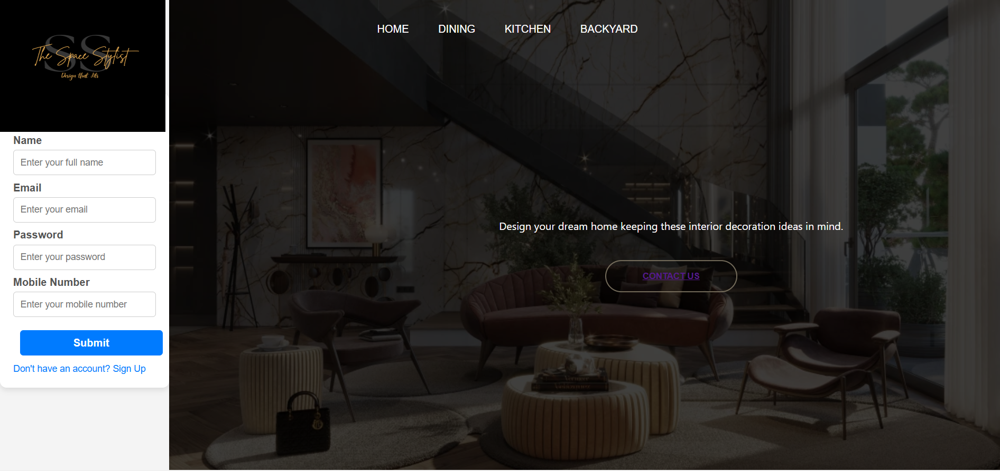

# [The Space Stylist] 🎯

## Basic Details
### Team Name: [Kaizen]

### Team Members
- Member 1: [Bhavana Prasanth] - [SCMS Cochin School of Business]
- Member 2: [Amirtha Vijayan] - [SCMS Cochin School of Business]

### Hosted Project Link
[[The Space Stylist]](https://rhea346.github.io/The-Space-Stylist/)

### Project Description

An visual idea about the interior design to be used in a mix of styles, patterns, and textures for a unique look. 

### Technologies/Components Used
For Software:
- [HTML and css]
- [Frameworks used]
- [Libraries used]
- [Tools used]

### Implementation
For Software:
# Installation
[commands]

# Run
[commands]

### Project Documentation
For Software:

# Screenshots (Add at least 3)

![Screenshot2]

*Add caption explaining what this shows*

# Build Photos

*Explain the build steps*

*Explain the final build*

### Project Demo
# Video
[Add your demo video link here]
*Explain what the video demonstrates*

# Additional Demos
[Add any extra demo materials/links]

## Team Contributions
- [Name 1]: [Specific contributions]
- [Name 2]: [Specific contributions]
- [Name 3]: [Specific contributions]

---
Made with ❤️ at TinkerHub
